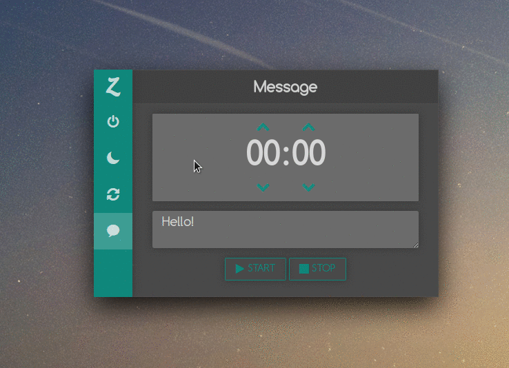

# Zomnifer

### [NEW] [Website](http://blog.caradeuc.info/zomnifer/)

## A problem to solve...

There are dozens of situations when a timer shutdown tool might come in handy, 
especially for users who leave their computer unattended for long periods of time. 
It does so happen that there's no real shortage of utilities of this type.

If you are currently looking for a simplistic app that can put your computer to sleep, restart it, 
or even shut it down for you based on specific timer inputs, then you might want to read further.

## ...How I solved the problem

This is how **Zomnifer** was born. This is an Electron-based, lightweight utility that can help you schedule 
your computer to either shutdown, sleep, restart or display a text message after the timer ends.

## You also can solve that problem ?

Download the .zip file (Windows only for now) in [the release section](https://github.com/benavern/zomnifer/releases), 
unzip it and execute the app.

Click the small taskbar icon, and you are presented with the app's compact interface. 
There are three self-explanatory sections, Switch Off, Sleep, and Message. 
To activate either one of the app's functions, you are required to input a time interval, 
followed by clicking the "START" button on the lower part of the main window.

## All plateforms

Available on :

* [x] Windows (tested on Windows 10)
* [x] Linux   (tested on elemetary os)
* [x] MacOs   (tested on macbook)

## Contribute

### Dev:

* `git clone https://github.com/benavern/zomnifer && cd zomnifer`
* `npm i`
* `npm start`

### Package:

* `npm run package:<platform>` (`win` / `linux` / `osx`)

### Issues / help

Don't hesitate to pull request, feature request, comment, report issues.

If you like my work, don't hesitate to [buy me some beer](https://www.paypal.me/benjamincaradeuc/5) :)

## License

[MIT](http://blog.caradeuc.info/MIT/#name=Benjamin%20Caradeuc&link=http://caradeuc.info/)
